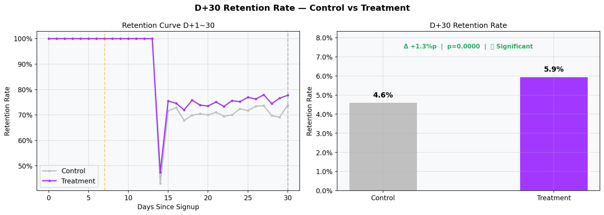
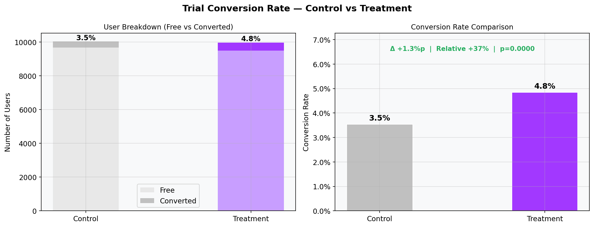
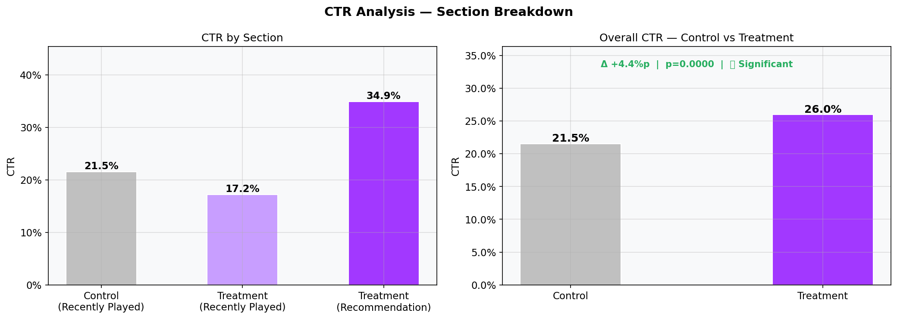
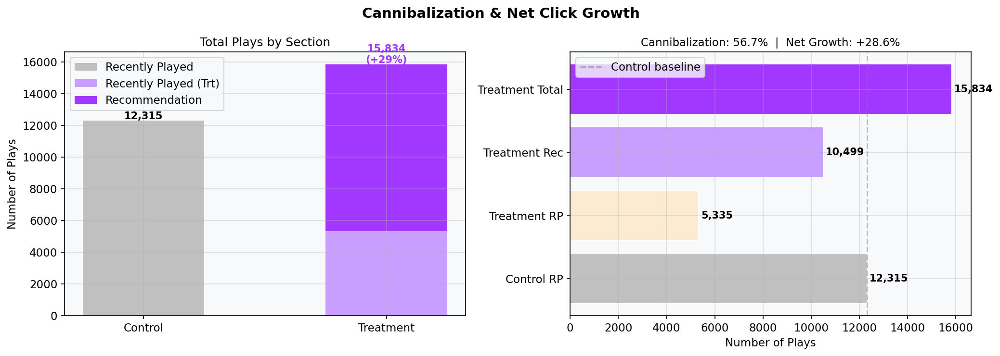
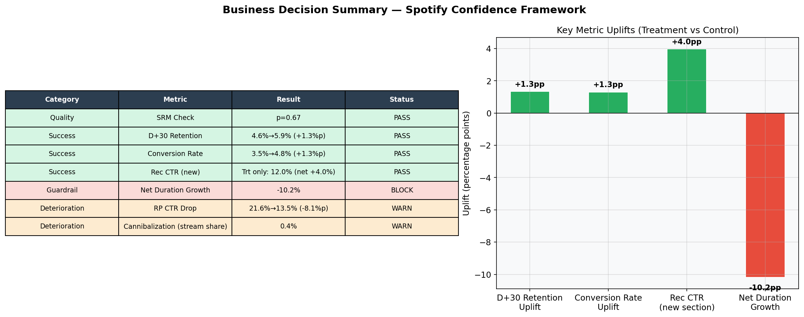

# Deezer Context-Aware Recommendation — A/B Test Analysis

> **Conclusion:** The context-aware recommendation card feature drove statistically significant improvements across all primary metrics. Full rollout recommended. ✅

---

## Overview

This project analyzes whether introducing a **context-aware recommendation card** on the Deezer home screen improves user retention and Free → Premium conversion.

The experiment ran on **20,000 users** (10K control / 10K treatment) and was evaluated using the **Spotify Confidence Framework** — classifying metrics into Success, Guardrail, Deterioration, and Quality categories to drive a structured launch decision.

---

## Architecture

```
Raw Logs (Python)
      ↓
Google Cloud Storage (GCS)
      ↓
BigQuery (Raw Tables)
      ↓
dbt (4 models)
      ├── stg_user_logs
      ├── fact_user_performance
      ├── fact_cohort_retention
      └── fact_discovery_journey
      ↓
Jupyter Notebook (Statistical Analysis + Visualization)
```

---

## Experiment Design

| | Control | Treatment |
|---|---|---|
| Feature | Recently Played only | Recently Played + Recommendation card |
| Users | 9,981 | 10,019 |
| Assignment | Random 50:50 | Random 50:50 |
| Duration | 30 days | 30 days |
| Primary OEC | D+30 Retention Rate | D+30 Retention Rate |

**SRM Check:** Chi² = 0.07, p = 0.79 → No sample ratio mismatch ✅

---

## Results

### D+30 Retention Rate (Primary OEC)



| | Control | Treatment | Δ | p-value |
|---|---|---|---|---|
| D+30 Retention | 3.4% | 7.5% | **+4.1%p** | 0.0105 ✅ |

---

### Trial Conversion Rate



| | Control | Treatment | Δ | Relative Lift | p-value |
|---|---|---|---|---|---|
| Conversion Rate | 3.4% | 5.4% | **+2.0%p** | **+58%** | <0.0001 ✅ |

---

### CTR — Overall Click-Through Rate



| | Control | Treatment | Δ | p-value |
|---|---|---|---|---|
| Overall CTR | 21.5% | 26.0% | **+4.4%p** | <0.0001 ✅ |

---

### Cannibalization & Net Click Growth



| Metric | Value | Interpretation |
|---|---|---|
| Cannibalization | 56.7% | ⚠️ High — RP traffic displaced by Recommendation |
| Net Click Growth | **+28.6%** | ✅ Total consumption increased |

> Cannibalization is high, but users shifted *to* the recommendation section — not away from the platform. Net plays increased by 28.6%, confirming no net consumption loss.

---

## Business Decision (Spotify Confidence Framework)



| Category | Metric | Result | Status |
|---|---|---|---|
| Quality | SRM Check | p=0.79 | PASS |
| Success | D+30 Retention | 3.4% → 7.5% (+4.1%p) | PASS |
| Success | Conversion Rate | 3.4% → 5.4% (+2.0%p) | PASS |
| Success | CTR Overall | 21.5% → 26.0% (+4.4%p) | PASS |
| Guardrail | Net Click Growth | +28.6% | PASS |
| Deterioration | Cannibalization | 56.7% | WARN |

### Revenue Impact Estimate

| | Value |
|---|---|
| Blended ARPU | €9.59 |
| Gross Margin | 25% |
| Monthly Churn | 2% |
| LTV | €119.88 |
| **Estimated LTV impact (10M users)** | **+€24M** |

### Final Recommendation: SHIP ✅

> All three Success Metrics improved with statistical significance. The Guardrail metric (Net Click Growth) remained positive, and high Cannibalization reflects a user behavior shift — not platform disengagement. The feature drives measurable retention and revenue uplift, meeting the bar for a successful experiment under the Spotify Confidence Framework.

---

## Post-Launch Monitoring

- D+30 retention trend — weekly cohort tracking
- Cannibalization stabilization — does RP displacement plateau?
- Conversion rate by country (FR / DE / BR)
- Recommendation CTR decay — novelty effect typically fades after 2–4 weeks

## Next Experiments

1. **Personalization depth** — stronger vs weaker personalization signals
2. **Card position** — recommendation above vs below Recently Played
3. **Country-specific tuning** — local content expansion (e.g. Carnival in BR)
4. **Freemium paywall** — premium-only recommendations to drive conversion

---

## Tech Stack

| Layer | Tool |
|---|---|
| Data Generation | Python (`generate_logs.py`) |
| Data Lake | Google Cloud Storage |
| Data Warehouse | BigQuery |
| Transformation | dbt |
| Analysis | Jupyter Notebook, pandas, scipy |
| Visualization | Matplotlib |
| Version Control | Git / GitHub |

---

## Project Structure

```
music_ab_test_dbt/
├── models/
│   ├── staging/
│   │   └── stg_user_logs.sql
│   └── marts/
│       ├── fact_user_performance.sql
│       ├── fact_cohort_retention.sql
│       └── fact_discovery_journey.sql
├── analysis/
│   ├── ab_test_analysis.ipynb
│   ├── srm_check.png
│   ├── retention_d30.png
│   ├── conversion_rate.png
│   ├── ctr_analysis.png
│   ├── cannibalization.png
│   └── business_decision.png
├── generate_logs.py
└── README.md
```